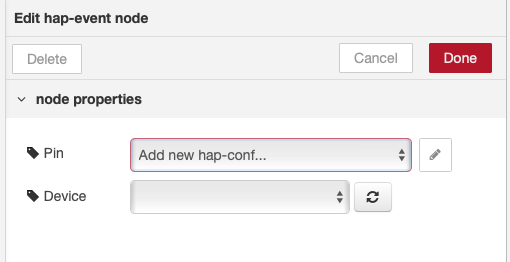

# Homebride and HAP-NodeRED

    

The above Node-RED Flow, turns on my 'Outside Office' light when the powder room is turned on, and turns them both off after 10 seconds. Not practical but a good sample of the power behind Node-RED.

# Table of Contents

<!--ts-->
   * [Homebride and HAP-NodeRED](#homebride-and-hap-nodered)
   * [Table of Contents](#table-of-contents)
   * [Introduction](#introduction)
   * [Installation](#installation)
         * [1 - Install Node-RED and Homebridge](#1---install-node-red-and-homebridge)
         * [2 - Prepare Homebridge for integration with HAP-NodeRED](#2---prepare-homebridge-for-integration-with-hap-nodered)
         * [3 - Install HAP-NodeRED into Node-Red](#3---install-hap-nodered-into-node-red)
         * [4 - Start Node-Red](#4---start-node-red)
         * [5 - Initial setup and configuration inside Node-Red](#5---initial-setup-and-configuration-inside-node-red)
         * [6 - Configure 'hap event' to receive updates from your Accessories](#6---configure-hap-event-to-receive-updates-from-your-accessories)
   * [Troubleshooting / DEBUG MODE](#troubleshooting--debug-mode)
      * [To start Node-RED in DEBUG mode, and output HAP-NodeRED debug logs start Node-RED like this.](#to-start-node-red-in-debug-mode-and-output-hap-nodered-debug-logs-start-node-red-like-this)

<!-- Added by: sgracey, at:  -->

<!--te-->

# Introduction

This is an Alpha release of the ability to integrate Homebridge Accessories into [Node-RED](https://nodered.org) so that you can start flows from Homebridge accessory events and control your existing homebridge accessories.  ( To create accessories in HomeKit, please use node-red-contrib-homekit-bridged. )

This create's two separate node's in Node-Red, the first node "hap event" listens for changes to an accessory (ie on/off) and sends a message into Node-Red containing the updated accessory status.  The second node "hap control" allows you to control a homebridge accessory.  Each node is tied to an individual characteristic of an accessory (ie on/off or brightness).  Using a dimmable light bulb as an example, you would configure two nodes for it.  The first for On/Off and the second for brightness.  

# Installation

### 1 - Install Node-RED and Homebridge

This is covered in alot of other places, so I won't cover it here.

### 2 - Prepare Homebridge for integration with HAP-NodeRED

Place your homebridge instances into "INSECURE MODE".  This is same as my [Homebridge Alexa](https://github.com/NorthernMan54/homebridge-alexa) plugin, and you just need to follow the [Prepare homebridge for plugin](https://github.com/NorthernMan54/homebridge-alexa#prepare-homebridge-for-plugin-installation) instructions there.

### 3 - Install HAP-NodeRED into Node-Red

    cd ~/.node-red
    npm install -g https://github.com/NorthernMan54/HAP-NodeRed

### 4 - Start Node-Red

### 5 - Initial setup and configuration inside Node-Red

* 5.1 Select 'hap event' node and place onto flow.
* 5.2 Double click on hap event node ( now called 'Choose accessory/event')

* 5.3 Please select the **pencil** to the right of the PIN Field.

* 5.4 Please enter your PIN, and select **Add**.

* 5.5 Now select **Done**.

* 5.6 Now select **Deploy**
* 5.7 Please wait about 30 seconds.  ( Node-RED is busy discovering all your accessories.)
* 5.8 Initial setup and config is complete.

### 6 - Configure 'hap event' to receive updates from your Accessories

* 6.1 Double click on hap event node ( now called 'Choose accessory/event')

* 6.2 The device drop down should now be populated with all your Homebridge accessories.

The accessory naming convention is:

Homebridge Instance Name ( From your config.json ), Accessory Name, Accessory Type, and Accessory characteristic

# Troubleshooting / DEBUG MODE

## To start Node-RED in DEBUG mode, and output HAP-NodeRED debug logs start Node-RED like this.

    DEBUG=*,-express* node-red
